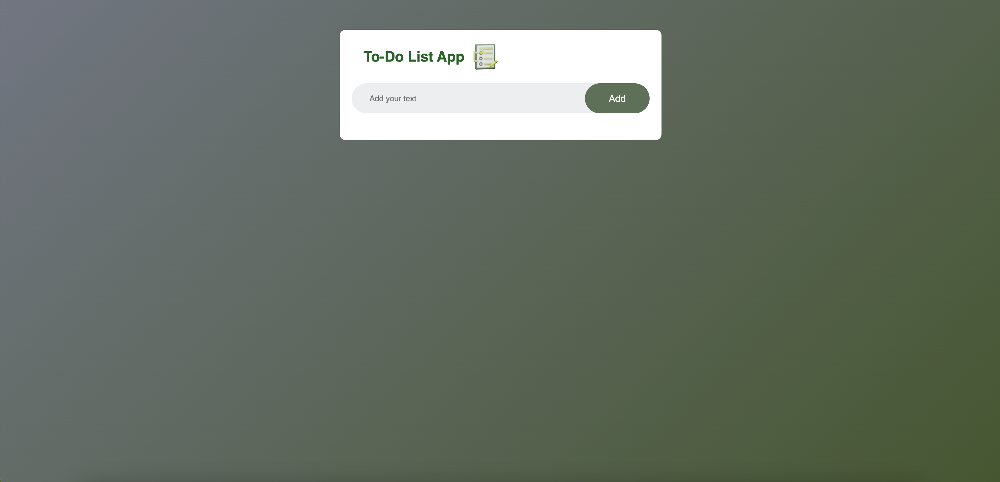
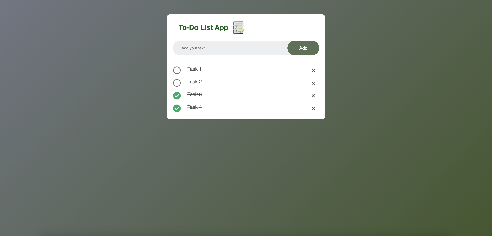

# To-Do List App

This simple To-Do List application allows users to list, mark, and remove tasks.




## Features

- Add new tasks.
- Mark tasks as complete.
- Delete tasks.
- Save your tasks to local storage, so your data is preserved when you reload the page.

## Usage

To use the application, follow these steps:

1. Clone the project from GitHub:
   ```bash
   git clone https://github.com/username/to-do-list-app.git
   ```
2. Navigate to the project folder:

   ```bash
   cd to-do-list-app
   ```

3. Open the HTML file in a web browser:

   Open the index.html file in a web browser.

4. To add a new task, type your task in the text box and click the "Add" button.
5. To mark a task as complete, click on the task.
6. To delete a task, click on the "x" icon next to the task.
7. Your tasks are stored in local storage and will be preserved when you reload the page.

## Contributing

If you want to contribute to the project, please follow these steps:

1. Fork this project.
2. Add new features or fixes.
3. Submit your changes with a pull request.
